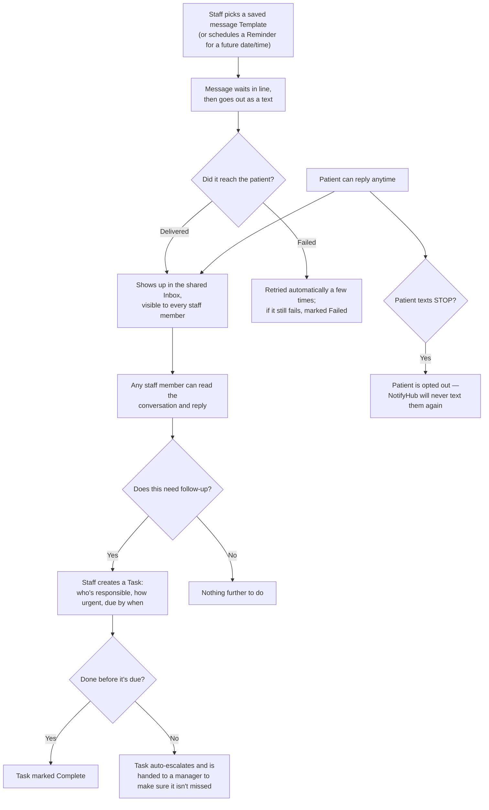

# How NotifyHub works (plain-English overview)

This page is for anyone new to the project who isn't a developer — it explains **what**
NotifyHub does and **how a message moves through it**, without any technical terms. For the
technical version (code locations, APIs, database), see [`CODEBASE_MAP.md`](../CODEBASE_MAP.md);
for the original requirements, see [`PROJECT_CONTEXT.md`](../PROJECT_CONTEXT.md).

## What is NotifyHub?

NotifyHub is a tool a clinic's front-desk/admin staff use to text patients — appointment
reminders, medication alerts, prescription notices — and to have a real two-way conversation
with them, all in one shared inbox. It also turns "this patient needs a follow-up" into a
trackable task so nothing falls through the cracks.

## The main flow

**In words:**
1. A staff member sends a message — either picked from a ready-made Template (e.g. "Your
   appointment is at {{time}}") or scheduled as a Reminder for a future date.
2. The message is sent out as a text. NotifyHub keeps trying automatically if the first attempt
   doesn't go through, and gives up (marks it Failed) only after a few retries.
3. The patient can text back at any point — their reply lands in a shared Inbox that every staff
   member can see, so anyone can pick it up, not just whoever sent the original message.
4. If a conversation needs someone to actually *do* something (call the patient, follow up with
   a doctor, etc.), staff turn it into a **Task** — who owns it, how urgent it is, and when it's
   due.
5. If a Task isn't finished in time, it doesn't just sit there — it automatically escalates and
   gets handed to a manager, so nothing quietly gets forgotten.
6. If a patient ever texts "STOP" (or similar), NotifyHub permanently stops texting them —
   no staff action can override that.

## The rest of the app, in one line each

Beyond the core conversation loop above, a few supporting screens exist:

- **Task Board** — a bird's-eye view of every open task, who it's assigned to, and how overdue
  it is.
- **Templates** — the library of reusable, fill-in-the-blank message texts staff pick from.
- **Dashboard** — a quick summary when you log in: your open tasks, unread conversations, and
  recent activity.
- **Audit Log** — a permanent record of who did what and when (every message sent, every reply,
  every task change) — for accountability, not day-to-day use.
- **Settings** — admin-only controls: quiet hours (don't text patients at night), how many texts
  a patient can receive in a given window, and which staff accounts exist.

## Who can do what

- **Staff** can read/reply to conversations, create and manage tasks, and use templates.
- **Admins** can do everything Staff can, plus manage other user accounts and change
  clinic-wide settings (quiet hours, rate limits).
